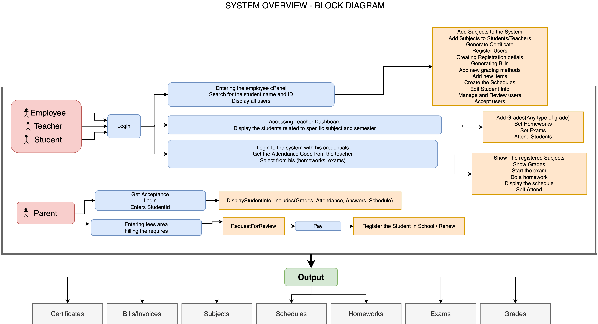
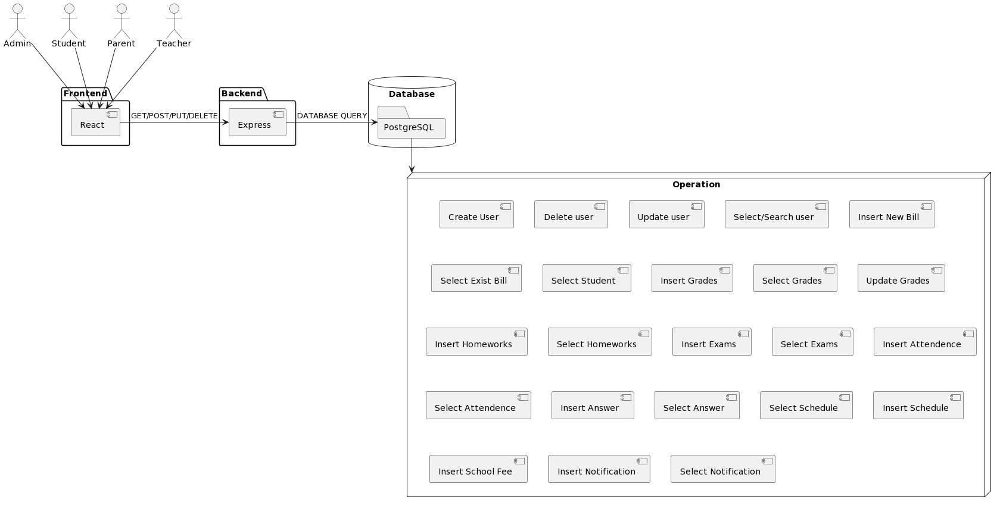
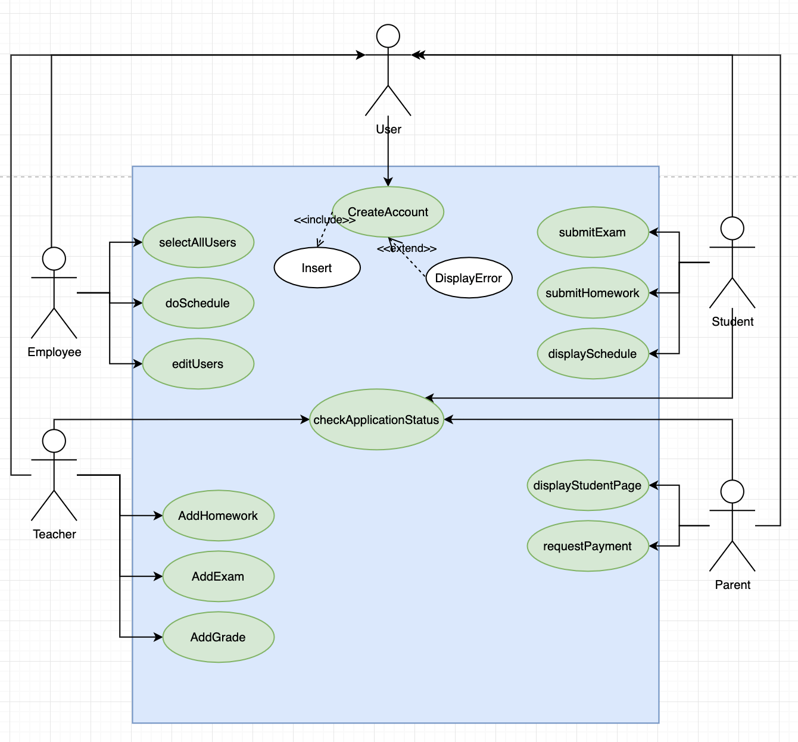

# Tugas Kelompok 1

# 1.Introduction

## 1.1 Purpose of this document

Sekolah ku adalah system management sekolah yang mencakup sebagian besar
operasional yang berkaitan dengan sekolah, antara lain: guru, siswa, orang tua,
karyawan, jadwal, kelas, mata pelajaran, bus dan biaya kuliah, Untuk
mengurangi penanganan kertas dan penggunaan metode modern dalam merekam data
yang akan memastikan bahwa pekerjaan akan dilakukan dalam waktu yang lebih singkat, lebih efisien
dan menyimpan data agar tidak hilang.

## 1.2 Scope of this document

Konsentrasi sistem ini dibagi menjadi tiga faktor sebagai berikut:

### Teacher

Guru dapat menambahkan Tugas Rumah (PR) dan ujian untuk
siswa, guru juga dapat menambahkan nilai siswa.

### Parent

Orang tua dapat memeriksa aktifitas anak mereka (nilai,
ujian, kursus), dan juga bisa melakukan pembayaran biaya sekolah secara online

### Admin/Employee

Admin dapat mengelola siswa seperti mengubah informasi siswa, orang tua siswa dan mengelola permintaan siswa (komplain dan lain lain)

### Student

Siswa dapat melihat jadwal mereka,mengirim PR, ujian dan dapat untuk melihat kehadiran mereka

## 1.3 Overview

## 1.4 System Architecture

## 1.5 Business Context

Tujuan utamanya adalah memberikan kepada pengguna sistem waktu yang lebih sedikit dan efisiensi yang lebih tinggi. Untuk lebih jelas, mudah mengakses data atau membuatnya di mana saja dengan lebih sedikit usaha. Demi mencapai semua ini, ide yang muncul adalah membuat sistem di mana setiap informasi tentang siswa tercatat, seperti: nilai-nilainya, pekerjaan rumahnya, mata pelajarannya, ujiannya, dan data pendaftarannya. Sistem ini juga memungkinkan guru untuk dengan mudah membuat pekerjaan rumah dan mengikuti tingkat siswa dengan memeriksa nilai, tingkat, dan tugas-tugasnya, dan poin terpenting yang memungkinkan sistem bagi orang tua untuk memeriksa statistik siswanya dan membayar biaya sekolahnya tanpa perlu ke sekolah. Akhirnya, sistem ini memungkinkan karyawan untuk membuat jadwal siswa tanpa perlu melakukannya secara manual, memeriksa data dan permintaan pendaftarannya secara online. Semua itu akan menjamin waktu yang lebih sedikit, usaha yang lebih sedikit, dan efisiensi yang lebih tinggi.

## 2.General Description

## 2.1 Product Functions

Sistem ini dapat diklasifikasikan menjadi:

### Teacher Main Functions:

1. Add Exam or homeworks:
   Guru bisa membuat ujian
   atau pekerjaan rumah kapan saja tanpa perlu pergi ke sekolah
2. Add Attendance:
   Guru dapat mengabsen siswa yang hadir di
   kelasnya.
3. Add students’ grades:
   Guru dapat menandai kertas siswa secara
   online dengan mudah.

### Student Main Functions

1.  Display schedule: Dapat melihat schedules mereka
2.  Submit exam or homework:Dapat melakukan submit PR mereka
3.  Display grades: Dapat melihat PR dan nilai keseluruhan
4.  Add Attendance: Siswa juga dapat hadir sendiri tetapi atas perintah
    gurunya karena dia memiliki kemampuan untuk membagikan kode kehadiran kepada siswa- bisa hadir dengan cara ini

### Parents Main Functions:

1. View student page: Orang tua dapat melakukan check kepada anak mereka seperti (nilai,absensi dan biaya sekolah) secara online
2. Pay student fees: Orang tua dapat melakukan pembayaran biaya sekolah

### Admin/Employee Main Functions:

1. Do schedule: Melakukan insert/edit Schedule kepada siswa
1. Edit Students Info: Dapat mengubah informasi siswa

## 2.2 Similar System Information

| Systems                 | Student | Teacher | Parents |
| ----------------------- | ------- | ------- | ------- |
| esKooly                 | Yes     | Yes     | No      |
| EZ school app           | No      | Yes     | Yes     |
| Sekolahku (system kita) | Yes     | Yes     | Yes     |

## 2.3 User Problem Statement

Permasalah akan dibagi sesuai dengan klasifikasi pengguna di
poin berikut:

### Parents

Masalah terbesar adalah jika mereka harus melakukan sesuatu yang berhubungan dengan anak, Mereka harus pergi ke sekolah.

### Student

Masalah siswa adalah disorganisasi dan yang dia tangani
dengan jumlah kertas yang banyak.

### Teacher

Masalah guru adalah bagaimana menangani dan mencari di kertas jika
jumlahnya sangat banyak.

### Admin/Employee

Masalah karyawan adalah dia mengerjakan tugas siswa
menjadwalkan secara manual sehingga membutuhkan banyak waktu untuk melakukannya untuk semua siswa.

# 3.Use Case Diagram

## 3.Scenario Usecase

### 3.1 CreateAccount

| (3.1)                                |                                                                                      |
| ------------------------------------ | ------------------------------------------------------------------------------------ |
| Function name                        | CreateAccount(firstName, secondName, thirdName, email…)                              |
| Description                          | Ambil data pengguna yang mendaftar dan masukkan ke dalam database                    |
| Input                                | Informasi user seperti firstName, secondName, thirdName, email dll                   |
| Ouput                                | Mengajukan permohonan agar ia dapat diterima dan kemudianmemiliki akses ke sistem    |
| Critically                           | Fungsi ini adalah yang paling penting, tanpanya pengguna tidak bisa akses ke sistem. |
| Technical issues                     | 1. Kesalahan selama Submit Form ,  2. Duplikasi username,phone dan email        |
| Risks                                | Ganguan Koneksi ketika user melakukan submit                                         |
| Dependencies with other requirements | NA                                                                                   |
|                                      |

### 3.2 displayStudentPage

| (3.2)                                |                                                                          |
| ------------------------------------ | ------------------------------------------------------------------------ |
| Function name                        | displayStudentPage(studentId)                                            |
| Description                          | Ambil data siswa dari database yang sesui dengan `studentId` parameter   |
| Input                                | `studentId`                                                              |
| Ouput                                | Informasi Siswa                                                          |
| Critically                           | Fungsi ini bisa membantu orang tua untuk mengecek nilai PR siswa         |
| Technical issues                     | `studentId` Tidak valid                                                  |
| Risks                                | Insert Data siswa tidak benar                                            |
| Dependencies with other requirements | Fungsi ini tidak dapat terjadi tanpa orang tua memiliki akun(Fungsi 3.1) |

### 3.3 addHomework

| (3.3)                                |                                                                                                            |
| ------------------------------------ | ---------------------------------------------------------------------------------------------------------- |
| Function name                        | addHomework(class_id, title, degree, details, image, deadline)                                             |
| Description                          | Melakukan insert POST dan akan dimasukkan ke dalam table `homeworks`                                       |
| Input                                | Homeworks’ attributes `(class_id, title, degree, details, image and deadline)`                             |
| Ouput                                | Pekerjaan rumah akan disimpan dan dimasukkan ke dalam database dan siapuntuk ditampilkan kepada siswa.     |
| Critically                           | Fungsi ini akan membantu guru untuk membuat pekerjaan rumah online.                                        |
| Technical issues                     | Konflik antar kelas                                                                                        |
| Risks                                | Database failure                                                                                           |
| Dependencies with other requirements | Fungsi ini tidak memerlukan cost tertentu; mungkin butuh beberapamenit untuk membuat ujian dalam database. |

### 3.4 addGrade

| (3.4)                                |                                                                                                                                                                                  |
| ------------------------------------ | -------------------------------------------------------------------------------------------------------------------------------------------------------------------------------- |
| Function name                        | addGrade(`student_id, subject_id, grade, grade_id, teacher_id`)                                                                                                                  |
| Description                          | Melakukan insert POST dan akan dimasukkan ke dalam table `gradingMethodValues`                                                                                                   |
| Input                                | `student_id, subject_id, grade, grade_id, teacher_id`                                                                                                                            |
| Ouput                                | Nilai telah ditambahkan dan siswa dapat memeriksanya                                                                                                                             |
| Critically                           | Fungsi ini memungkinkan guru untuk menambahkan nilai siswa secara online                                                                                                         |
| Technical issues                     | Nilai melebihi batas metode penilaian dan Nilai lebih kecil dari 0                                                                                                               |
| Risks                                | Database failure                                                                                                                                                                 |
| Dependencies with other requirements | Guru harus memiliki akun di sistem, guru harus telah menambahkan pekerjaan rumah dan siswa harus menyerahkannya pekerjaan rumah di database (fungsi 3.1, fungsi 3.3, fungsi 3.7) |

### 3.5 submitHomework

| (3.5)                                |                                                                                                                                                                                                       |
| ------------------------------------ | ----------------------------------------------------------------------------------------------------------------------------------------------------------------------------------------------------- |
| Function name                        | submitHomework(`student_id, homework_id, arrayOfAnswers`)                                                                                                                                             |
| Description                          | Melakukan insert POST dan akan dimasukkan ke dalam table `answers`                                                                                                                                    |
| Input                                | `student_id, homework_id, arrayOfAnswers`                                                                                                                                                             |
| Ouput                                | Jawaban siswa sudah tersimpan di database dan kemudianguru dapat menampilkannya                                                                                                                       |
| Critically                           | Fungsi ini memungkinkan siswa untuk mengirimkan pekerjaan rumahnya secara online                                                                                                                      |
| Technical issues                     | Error saat mengirimkan pekerjaan rumah.                                                                                                                                                               |
| Risks                                | Kegagalan Sistem: Hasil dari tekanan pada sistem karena sejumlah besar pengiriman pada sistem                                                                                                         |
| Dependencies with other requirements | Untuk menyerahkan pekerjaan rumah, siswa harus memiliki akun , pekerjaan rumah harus dibuat oleh guru di database dan siswa harus membayar biayanya sehingga tergantung pada (fungsi 3.1, fungsi 3.4) |

### 3.6 checkApplicationStatus

| (3.6)                                |                                                                                                                                      |
| ------------------------------------ | ------------------------------------------------------------------------------------------------------------------------------------ |
| Function name                        | checkApplicationStatus(`applicationNumber`)                                                                                          |
| Description                          | Melakukan GET pada tabel `users` dan akan melakukan check pada kondisi tertentu                                                      |
| Input                                | `applicationNumber`                                                                                                                  |
| Ouput                                | Status penerimaan, ya atau tidak.                                                                                                    |
| Critically                           | Fungsi ini memungkinkan pengguna untuk memeriksa apakah mereka telah meninjau oleh sekolah dan diterima atau tidak                   |
| Technical issues                     | `applicationNumber` tidak valid.                                                                                                     |
| Risks                                | System Failures                                                                                                                      |
| Dependencies with other requirements | Untuk memeriksa status aplikasi pengguna harus CreateAccount dan kemudian menerima nomor yang akan ditampilkan kepadanya fungsi(3.1) |

### 3.7 generateBill

| (3.7)                                |                                                                                                                       |
| ------------------------------------ | --------------------------------------------------------------------------------------------------------------------- |
| Function name                        | generateBill(`student_id`)                                                                                            |
| Description                          | Ambil id siswa sebagai parameter dan kemudian lakukan kueri SQL itu memilih semua tagihan yang terkait dengan id ini, |
| Input                                | `student_id`                                                                                                          |
| Ouput                                | List Pembayaran                                                                                                       |
| Critically                           | Fungsi ini memungkinkan karyawan/admin untuk menampilkan tagihan untuk siswa tertentu.                                |
| Technical issues                     | `student_id` tidak valid.                                                                                             |
| Risks                                | System Failures                                                                                                       |
| Dependencies with other requirements | Untuk menghasilkan Bill, karyawan harus memiliki akun dan juga siswa, jadi tergantung pada Function(3.1)              |

### 3.8 displaySchedule

| (3.8)                                |                                                                                                          |
| ------------------------------------ | -------------------------------------------------------------------------------------------------------- |
| Function name                        | displaySchedule(`student_id,class_id`)                                                                   |
| Description                          | TBA                                                                                                      |
| Input                                | `student_id,class_id`                                                                                    |
| Ouput                                | Daftar schedule pelajaran/ujian                                                                          |
| Critically                           | TBA                                                                                                      |
| Technical issues                     | `student_id,class_id` tidak valid.                                                                       |
| Risks                                | System Failures                                                                                          |
| Dependencies with other requirements | Untuk menghasilkan Bill, karyawan harus memiliki akun dan juga siswa, jadi tergantung pada Function(3.1) |

### 3.9 doSchedule

| (3.9)                                |                                                                                                          |
| ------------------------------------ | -------------------------------------------------------------------------------------------------------- |
| Function name                        | doSchedule(`class_id,admin_id`)                                                                          |
| Description                          | TBA                                                                                                      |
| Input                                | `student_id,class_id,admin_id`                                                                           |
| Ouput                                | Membuat Daftar schedule pelajaran/ujian pada kelas                                                       |
| Critically                           | TBA                                                                                                      |
| Technical issues                     | `class_id,admin_id` tidak valid.                                                                         |
| Risks                                | System Failures                                                                                          |
| Dependencies with other requirements | Untuk menghasilkan Bill, karyawan harus memiliki akun dan juga siswa, jadi tergantung pada Function(3.1) |

### 3.10 editUsers

| (3.10)                               |                                                                                                          |
| ------------------------------------ | -------------------------------------------------------------------------------------------------------- |
| Function name                        | editUsers(`student_id, fullname,lastname phone ..etc`)                                                   |
| Description                          | TBA                                                                                                      |
| Input                                | `student_id, fullname,lastname phone ..etc`                                                              |
| Ouput                                | Mengubah informasi user                                                                                  |
| Critically                           | TBA                                                                                                      |
| Technical issues                     | `student_id, fullname,lastname phone ..etc` tidak valid.                                                 |
| Risks                                | System Failures                                                                                          |
| Dependencies with other requirements | Untuk menghasilkan Bill, karyawan harus memiliki akun dan juga siswa, jadi tergantung pada Function(3.1) |

### 3.11 selectAllUsers

| (3.11)                               |                                                                                                          |
| ------------------------------------ | -------------------------------------------------------------------------------------------------------- |
| Function name                        | selectAllUsers(`email or name or phone`)                                                                 |
| Description                          | TBA                                                                                                      |
| Input                                | `email or name or phone`                                                                                 |
| Ouput                                | Mencari user berdasarkan `email or name or phone`                                                        |
| Critically                           | TBA                                                                                                      |
| Technical issues                     | `email or name or phone` tidak valid.                                                                    |
| Risks                                | System Failures                                                                                          |
| Dependencies with other requirements | Untuk menghasilkan Bill, karyawan harus memiliki akun dan juga siswa, jadi tergantung pada Function(3.1) |

### 3.12 submitExam

| (3.12)                               |                                                                                                                                                                                                       |
| ------------------------------------ | ----------------------------------------------------------------------------------------------------------------------------------------------------------------------------------------------------- |
| Function name                        | submitExam(`student_id, exam_id, arrayOfAnswers`)                                                                                                                                                     |
| Description                          | Melakukan insert POST dan akan dimasukkan ke dalam table `exam`                                                                                                                                       |
| Input                                | `student_id, exam_id, arrayOfAnswers`                                                                                                                                                                 |
| Ouput                                | Jawaban siswa sudah tersimpan di database dan kemudian guru dapat menampilkannya                                                                                                                      |
| Critically                           | Fungsi ini memungkinkan siswa untuk mengirimkan pekerjaan rumahnya secara online                                                                                                                      |
| Technical issues                     | Error saat mengirimkan pekerjaan rumah.                                                                                                                                                               |
| Risks                                | Kegagalan Sistem: Hasil dari tekanan pada sistem karena sejumlah besar pengiriman pada sistem                                                                                                         |
| Dependencies with other requirements | Untuk menyerahkan pekerjaan rumah, siswa harus memiliki akun , pekerjaan rumah harus dibuat oleh guru di database dan siswa harus membayar biayanya sehingga tergantung pada (fungsi 3.1, fungsi 3.4) |

### 3.13 addExam

| (3.13)                               |                                                      |
| ------------------------------------ | ---------------------------------------------------- |
| Function name                        | addExam(`class_id, exam_id, teacher_id`)             |
| Description                          | Guru membuat jadwal ujian pada kelas tertentu `exam` |
| Input                                | `student_id, exam_id, teacher_id`                    |
| Ouput                                | Siswa dapat melihat jadwal ujian                     |
| Critically                           | TBA                                                  |
| Technical issues                     | System Error                                         |
| Risks                                | TBA                                                  |
| Dependencies with other requirements | TBA                                                  |

